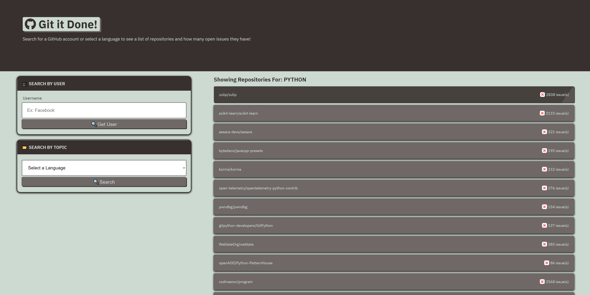
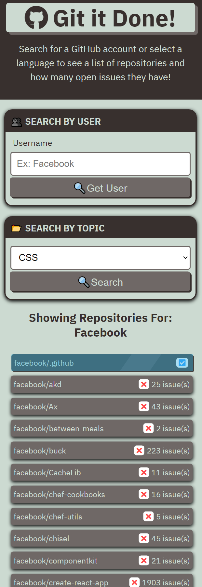

# :clipboard: Git-It-Done :clipboard:

#### Looking for public repositories and their active issues? Look no further, Git-It-Done is here to help you get it done. :wink:

:computer: **Live Deployment:** https://jwilferd10.github.io/git-it-done/

:computer: **Github Repository:** https://github.com/jwilferd10/git-it-done

## :open_file_folder: Table of Contents:
  - [Preview](#camera-preview)
  - [Demo](#movie_camera-demo)
  - [Description](#wave-description)
  - [User Story](#book-user-story)
  - [Resources Used](#floppy_disk-resources-used)
  - [Installation](#minidisc-installation-and-usage)
  - [Contributors](#paperclip-contributors)
  - [Contact Information](#e-mail-contact-information)

## :camera: Preview:

  
  

## :movie_camera: Demo:

## :wave: Description: 

 
Git-It-Done is an application that allows users to search for other accounts on GitHub. When searched you can view an array of public repositories associated with that account. When clicking a specific repository users are brought to a second HTML page and any active Issue and Pull Request will be displayed in a list. Additionally users can use this application to search for active repositories based on a programming language. Finally, when users click on any Issue or Pull Request they will be redirected to it's active GitHub post.

Git-It-Done was brought to life through JavaScript and GitHub's API, this application was the first time I utilized third-party API's within a project and was a part of my course at the UCLA Coding Bootcamp. However feeling the need to go further and proudly call this app my own, I have extended and improved upon this app by adding new features and visual changes that weren't apart of the base project.

To further note, the base bootcamp project ended at commit 39168de68f29a98bc757df8d5fcd1d2d95a9fb29, anything after are ammendments that I personally made. My specific changes targeted the 'Search By Topic', users must now use a form select to pick from a variety of languages, allowing for a smoother user experience. Additionally my changes were focused on the UI of the app and it's reliability on mobile devices. Big thanks to the UCLA Coding Bootcamp for their direction, thank YOU for checking Git-It-Done out - I hope you enjoy it and happy coding!

  
## :book: User Story:
**AS A developer searching for public repositories**
- I WANT an application that finds public repositories with their associated issues
- SO THAT I can learn more about or contribute to that app

**GIVEN I need to search through GitHub**
- WHEN I open the app
	- THEN I am presented with a page that has two search options
- WHEN I search for a user
	- THEN I am presented with a list of the users public repositories
- WHEN I select a topic
	- THEN I am presented with a list of repositories tagged with that topic
- WHEN I click on a repository 
	- THEN I am brought to a second page containing a list of all the repositories' issues/pull-requests
- WHEN I click on an issue/pull-request
	- THEN I'm brought to it's link on GitHub

## :floppy_disk: Resources Used:
Main Resources:
- HTML
- CSS
- JavaScript
- GitHub API

## :minidisc: Installation and Usage:
### Install:
- You can do this by clicking the *GREEN* button above and you can download it by ZIP or copy the SSH!
### Usage:
There's two ways you can use this app:
1) Fill the text area out with a VALID GitHub account
2) Click on a topic from the form select

- Click any button with a :mag: to start your search.
- After a second a list of generated repositories should appear on the screen
- By clicking on a specific repository, you will see a new page featuring all of it's Issues and Pull Request
- Clicking any issue or pull request will bring you to that post here in GitHub.

## :paperclip: Contributors
- UCLA Coding Bootcamp (Setup of main project)
- jwilferd10

## :e-mail: Contact Information:
- ### [jwilferd10](https://github.com/jwilferd10)
